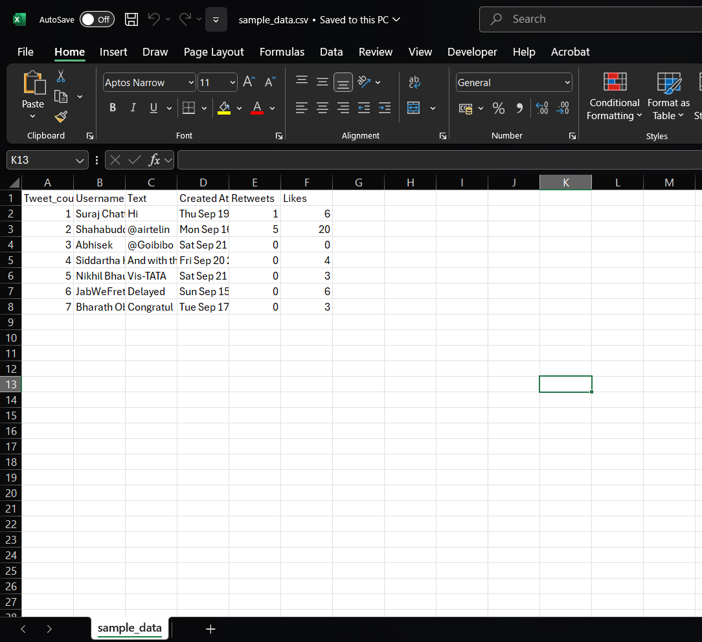
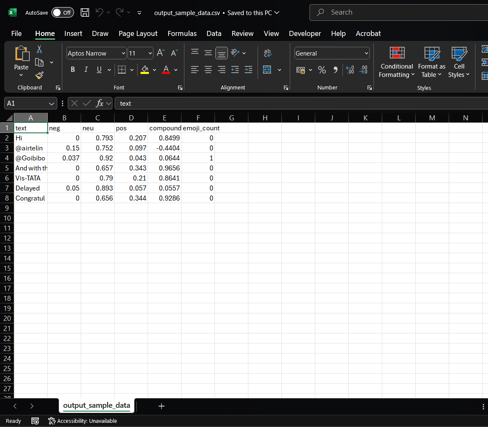
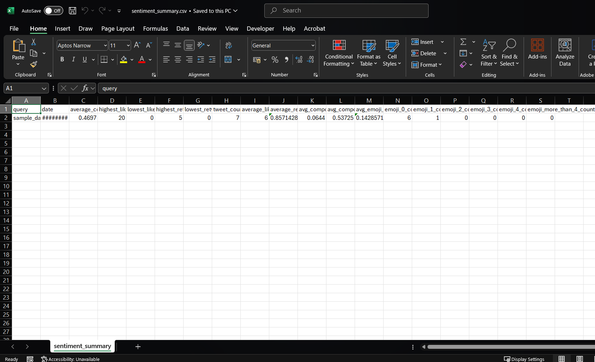

# Are Emojis the New Words?

Emojis have become an increasingly important aspect of consumer-brand interactions in the Indian subcontinent. However, the impact of emoji use on brand image and mental health remains underexplored, particularly in emerging economies like India, where structured research on this topic is limited. To address this gap, the present study analyzes over 4,600 consumer tweets related to 19 prominent brands across eleven industries. Using VADER sentiment analysis, the research develops a metric to assess consumer sentiment and brand engagement in relation to emoji usage. The findings indicate that effective integration of emojis contributes to positive consumer sentiment and enhanced brand engagement. Given that emojis have become a fundamental part of everyday communication, this study recommends that brand and marketing managers closely monitor consumer interactions with emojis, utilizing rich data to refine communication strategies and maximize emoji-driven engagement.

## Authors

- Dev Vora [GitHub](https://www.github.com/DevVora5) [LinkedIn](https://www.linkedin.com/in/vora-dev/)
- Siddharth Vaddepalli [Github](https://github.com/siddharth140) [LinkedIn](https://www.linkedin.com/in/siddharth-vaddepalli/)

## Installation

To install the dependencies:

```bash
pip install -r requirements.txt
```

## Deployment

To run this project:

```bash
python project.py
```

## Demo

Sample_Data.csv:

📌 This file contains the raw tweets that will be analyzed.
✅ Columns:

- Tweet_count – Serial number of the tweet.
- Username – Name of the Twitter user.
- Text – The actual tweet content.
- Created At – Date & time when the tweet was posted.
- Retweets – Number of times the tweet was retweeted.
- Likes – Number of likes the tweet received.



Output_Sample_data.csv:

📌 This file stores the sentiment scores for each tweet.
✅ Columns:

- text – The original tweet text.
- neg – Negative sentiment score (0 to 1).
- neu – Neutral sentiment score (0 to 1).
- pos – Positive sentiment score (0 to 1).
- compound – Overall sentiment score (ranges from -1 to 1).
- emoji_count – Number of emojis used in the tweet.



Sentiment_summary.csv:

📌 This file gives a summary of the sentiment analysis for all tweets.
✅ Columns:

- query – The search term used for tweets (if applicable).
- date – Date of the analysis.
- average_compound – Average sentiment score across all tweets.
- highest_likes / lowest_likes – Most & least liked tweets.
- highest_retweets / lowest_retweets – Most & least retweeted tweets.
- tweet_count – Total number of tweets analyzed.
- average_likes / average_retweets – Average engagement per tweet.
- avg_compound_with_emojis – Average sentiment for tweets with emojis.
- avg_compound_without_emojis – Average sentiment for tweets without emojis.
- avg_emoji_count – Average number of emojis per tweet.
- Emoji Counts: Number of tweets with 0, 1, 2, 3, 4, or more than 4 emojis.


